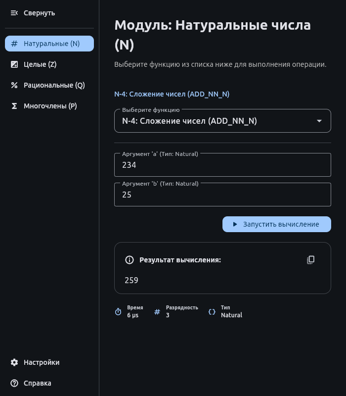

# 🏛 Система компьютерной алгебры (CAS)

[](https://www.python.org/downloads/)
[](https://flet.dev/)

Проект разработан в рамках [коллоквиума](https://docs.google.com/document/d/1Dv_6AIhxg_3ezu6VMcEnMpyfRzgym9l8PmE4ULGfjgM/edit?tab=t.0) по дисциплине **«Дискретная математика и теоретическая информатика» (ДМиТИ)**.

## 📖 Описание

Данная система предназначена для выполнения точных математических вычислений над различными типами данных. В отличие от стандартных калькуляторов, CAS работает с объектами произвольной точности и сохраняет структуру математических выражений.

### Поддерживаемые типы данных:

- **N** — Натуральные числа (произвольной длины).
- **Z** — Целые числа.
- **Q** — Рациональные числа (дроби).
- **P** — Многочлены с рациональными коэффициентами.

---

## 🖼 Интерфейс

<p align="center">
  
  <br>
  <em>Пример работы интерфейса системы</em>
</p>

---

## ⚡ Быстрый старт

### 1. Подготовка окружения

Убедитесь, что у вас установлен **Python 3.10** или выше.

```bash
# Клонируйте репозиторий
git clone https://github.com/dmitrii1011sg/colloquium-dmiti
cd colloquium-dmiti

# Создайте и активируйте виртуальное окружение
python -m venv venv

# Для Windows:
.\venv\Scripts\activate
# Для Linux/macOS:
source venv/bin/activate

# Установите зависимости
pip install -r requirements.txt

# Установите pre-commit хуки (опционально, для разработки)
pre-commit install
```

### 2. Запуск приложения

```powershell
# GUI
python src/main.py

# CLI
python src/cas.py -h
```

## 🛠 Сборка приложения (GUI)

Для автоматизации сборки под разные платформы используйте скрипт build.sh.

### 🌐 Web-версия (рекомендуется для WSL)

Создает универсальное приложение, доступное через браузер.
Запустите ./build.sh и выберите пункт Web.
После завершения запустите сервер:

```powershell
flet serve
```

Откройте в браузере: http://localhost:8000

### 🐧 Linux Native версия

Требует установленного Flutter и системных библиотек (clang, cmake, ninja, pkg-config).

Запустите ./build.sh и выберите пункт Linux (Native).

Результат будет в 'build/linux/...'.

**Поддержка платформ**: Благодаря использованию Flet, возможна сборка под Windows, Android, iOS и macOS при наличии соответствующих SDK.

## 👥 Состав команды:

| ФИО                 | Группа | Роль в проекте    |
| :------------------ | :----: | :---------------- |
| **Горшков Дмитрий** |  5381  | Архитектор        |
| **Кацеба Андрей**   |  5381  | Контроль качества |
| Жуков Александр     |  5381  | Разработчик       |
| Литвиненко Владимир |  5381  | Разработчик       |
| Лопатин Дмитрий     |  5381  | Разработчик       |
| Жулин Максим        |  5381  | Разработчик       |
| Помаскин Макар      |  5381  | Разработчик       |
| Чугунников Валерий  |  5382  | Разработчик       |
